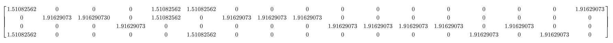
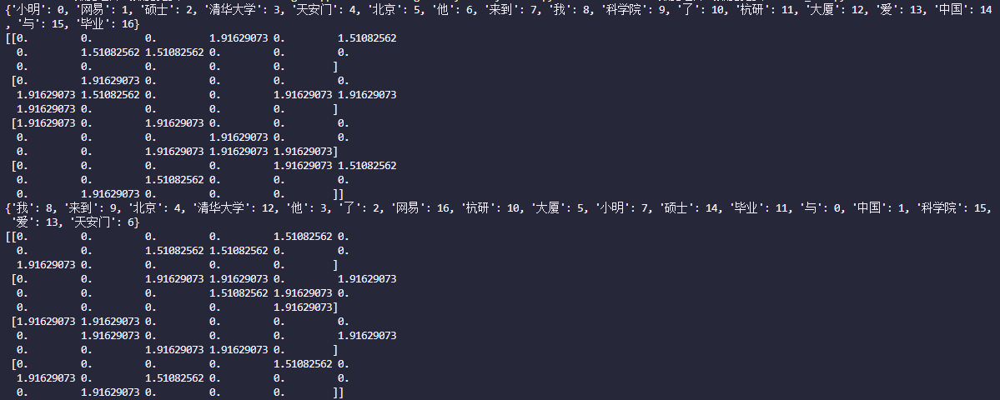

### 1. 手工计算与程序计算tf-idf值

```
{"我":1, "他":2, "了":3, "与":4, "来到":5, "北京":6, "网易":7, "杭研":8, "大厦":9, "小明":10, "硕士":11, "毕业":12, "中国":13, "爱":14, "科学院":15, "天安门":16, "清华大学":17}
```

Bow向量化：  
$$
\begin{bmatrix}
1&0&0&0&1&1&0&0&0&0&0&0&0&0&0&0&1 \\\\
0&1&1&0&1&0&1&1&1&0&0&0&0&0&0&0&0 \\\\
0&0&0&1&0&0&0&0&0&1&1&1&1&0&1&0&0 \\\\
1&0&0&0&0&1&0&0&0&0&0&0&0&0&0&1&0
\end{bmatrix}
$$
TF-IDF向量化：  



使用[程序](tf\_idf.py)跑出的结果如下]()：  



上面是手写的 `tfidf` 算法实现结果，下面是调用的 `sklearn` 库实现结果。可以看到一样。  

### 2. CBOW前向与反向传播推导过程


#### 2.1 前向传播  

$$
\begin{bmatrix}
x\_1\\\\x\_2\\\\x\_3\\\\\vdots\\\\x\_k\\\\\vdots\\\\x\_v
\end{bmatrix}
\times W\_{V\times N}\longrightarrow
\begin{bmatrix}
h\_1\\\\h\_2\\\\h\_3\\\\\vdots\\\\h\_i\\\\\vdots\\\\h\_N
\end{bmatrix}
\times W'\_{N\times V}\longrightarrow
\begin{bmatrix}
u\_1\\\\u\_2\\\\u\_3\\\\\vdots\\\\u\_j\\\\\vdots\\\\u\_V
\end{bmatrix}
\longrightarrow
\begin{bmatrix}
y\_1\\\\y\_2\\\\y\_3\\\\\vdots\\\\y\_j\\\\\vdots\\\\y\_V
\end{bmatrix}\\\\
W^T\_{V\times N}X=
\begin{bmatrix}
w\_{11}&w\_{21}&\cdots&w\_{V1}\\\\
w\_{12}&w\_{22}&\cdots&w\_{V2}\\\\
\vdots&\vdots&\vdots&\vdots\\\\
w\_{1N}&w\_{2N}&\cdots&w\_{VN}
\end{bmatrix}
\times
\begin{bmatrix}
x\_1\\\\x\_2\\\\x\_3\\\\\vdots\\\\x\_k\\\\\vdots\\\\x\_V
\end{bmatrix}
\=
\begin{bmatrix}
h\_1\\\\h\_2\\\\h\_3\\\\\vdots\\\\h\_i\\\\\vdots\\\\h\_N
\end{bmatrix}
\=h\\\\
W'^T\_{N\times V}h=
\begin{bmatrix}
w'\_{11}&w'\_{21}&\cdots&w'\_{N1}\\\\
w'\_{12}&w'\_{22}&\cdots&w'\_{N2}\\\\
\vdots&\vdots&\vdots&\vdots\\\\
w'\_{1V}&w'\_{2V}&\cdots&w'\_{NV}
\end{bmatrix}
\times
\begin{bmatrix}
h\_1\\\\h\_2\\\\h\_3\\\\\vdots\\\\h\_i\\\\\vdots\\\\h\_N
\end{bmatrix}
\=
\begin{bmatrix}
u\_1\\\\u\_2\\\\u\_3\\\\\vdots\\\\u\_j\\\\\vdots\\\\u\_N
\end{bmatrix}
=u\\\\
y\_i=\frac{e^{u\_j}}{\sum\_{k=1}^Ve^{u\_k}}
$$
#### 2.2 反向传播

$$
\begin{align}
E&=-logy\\\\
\frac{\partial E}{\partial u\_j}
&=\frac{\partial (-log\frac{e^{u\_{j'}}}{\sum\_{k=1}^Ve^{y\_k}})}{\partial u\_j}
=\frac{\partial (log\sum\_{k=1}^Ve^{y\_k}-loge^{u\_{j'}})}{\partial u\_j}
=\frac{e^{u\_{j'}}}{\partial u\_j}
=y\_j-t\_{j'}\\\\
t\_{j'}&=
\begin{cases}
1\ \ \ \ \ \ \ \ \ \ \ \ \ \ \ j'=j\\\\
0\ \ \ \ \ \ \ \ \ \ \ \ \ \ \ j'\neq j
\end{cases}\\\\
\frac{\partial E}{\partial w'\_{ij}}&=\frac{\partial E}{\partial u\_j}\cdot\frac{\partial u\_j}{\partial w'\_{ij}}=(y\_j-t\_{j'})\cdot h\_i\\\\
∴ w'\_{ij}&=w'\_{ij}-\eta \cdot (y\_i-t\_{j'})\cdot h\_i\\\\
\frac{\partial E}{\partial h\_i}
&=\sum\_{k=1}^V(\frac{\partial E}{\partial u\_k}\cdot\frac{\partial u\_k}{\partial h\_i})
=\sum\_{k=1}^V(y\_k-t\_{k'})w'\_{ik}
=W'\_i\cdot P\\\\
其中&\ W'\_i\ 为\ W'\ 的第i行,\ P=\\{y\_j-t\_{j'}|j=1,2,\cdots ,V\\}\\\\
∴ \frac{\partial E}{\partial h}
&=W'\cdot P\\\\
\frac{\partial E}{\partial w\_{ki}}
&=\frac{\partial E}{\partial h}\cdot \frac{\partial h}{\partial w\_{ki}}
=W'\cdot P\cdot x\_k\\\\
\frac{\partial E}{\partial w\_{ki}}
&=w\_{ki}-\eta\cdot (W'\cdot P\cdot x\_k)
=w\_{ki}-\eta\cdot W'\cdot P
\end{align}
$$

### 3. 使用层次 softmax 的计算量差别

1. 层次 **softmax** 把 **N** 分类问题编程 **log(N)** 次二分类问题，利用哈夫曼树构造很多二分类。
2. 不必求神经网络隐藏层中的权值矩阵，而是改求哈夫曼树中每个节点的权值向量。

### 4. word2vec 在数据挖掘应用中的影响

#### 4.1 推荐系统

​	word2vec（或者其他词向量模型）相比过去的方法能提供更好的单词的向量表示，使得NLP发生重大的变革。就像词向量变革了NLP一样，item嵌入（item这里的信息的含义可以非常广泛，比如咨询、电影和商品等，下文中统称为item）也变革了推荐系统模型。

​	用户活动难以通过更直接的方式捕获的抽象特征。 例如，如何编码Airbnb列表的“架构，风格和感觉”等品质？事实证明，word2vec方法在提取这些隐藏的信息方面是成功的，并且能够在这些抽象维度上对item进行比较，搜索和分类，为更智能、更好的推荐系统提供了可能。 在商业上，雅虎在将这种技术应用到他们的广告中时，点击率提高了9％，而AirBNB在其类似列表轮播上的点击率提升了21％，该产品推动了99％的预订以及搜索排名。

#### 4.2 文本情感分类

​	情感分析是一种常见的自然语言处理（NLP）方法的应用，特别是在以提取文本的情感内容为目标的分类方法中。通过这种方式，情感分析可以被视为利用一些情感得分指标来量化定性数据的方法。尽管情绪在很大程度上是主观的，但是情感量化分析已经有很多有用的实践，比如企业分析消费者对产品的反馈信息，或者检测在线评论中的差评信息。

​       最简单的情感分析方法是利用词语的正负属性来判定。句子中的每个单词都有一个得分，乐观的单词得分为 +1，悲观的单词则为 -1。然后我们对句子中所有单词得分进行加总求和得到一个最终的情感总分。很明显，这种方法有许多局限之处，最重要的一点在于它忽略了上下文的信息。例如，在这个简易模型中，因为“not”的得分为 -1，而“good”的得分为 +1，所以词组“not good”将被归类到中性词组中。尽管词组“not good”中包含单词“good”，但是人们仍倾向于将其归类到悲观词组中。       另外一个常见的方法是将文本视为一个“词袋”。我们将每个文本看出一个1xN的向量，其中N表示文本词汇的数量。该向量中每一列都是一个单词，其对应的值为该单词出现的频数。例如，词组“bag of bag of words”可以被编码为 [2, 2, 1]。这些数据可以被应用到机器学习分类算法中（比如罗吉斯回归或者支持向量机），从而预测未知数据的情感状况。需要注意的是，这种有监督学习的方法要求利用已知情感状况的数据作为训练集。虽然这个方法改进了之前的模型，但是它仍然忽略了上下文的信息和数据集的规模情况。

​	谷歌开发了一个叫做 Word2Vec 的方法，该方法可以在捕捉语境信息的同时压缩数据规模。Word2Vec实际上是两种不同的方法：Continuous Bag of Words (CBOW) 和 Skip-gram。CBOW的目标是根据上下文来预测当前词语的概率。Skip-gram刚好相反：根据当前词语来预测上下文的概率（如图 1 所示）。这两种方法都利用人工神经网络作为它们的分类算法。起初，每个单词都是一个随机 N 维向量。经过训练之后，该算法利用 CBOW 或者 Skip-gram 的方法获得了每个单词的最优向量。

​	现在这些词向量已经捕捉到上下文的信息。我们可以利用基本代数公式来发现单词之间的关系（比如，“国王”-“男人”+“女人”=“王后”）。这些词向量可以代替词袋用来预测未知数据的情感状况。该模型的优点在于不仅考虑了语境信息还压缩了数据规模（通常情况下，词汇量规模大约在300个单词左右而不是之前模型的100000个单词）。因为神经网络可以替我们提取出这些特征的信息，所以我们仅需要做很少的手动工作。但是由于文本的长度各异，我们可能需要利用所有词向量的平均值作为分类算法的输入值，从而对整个文本文档进行分类处理。
